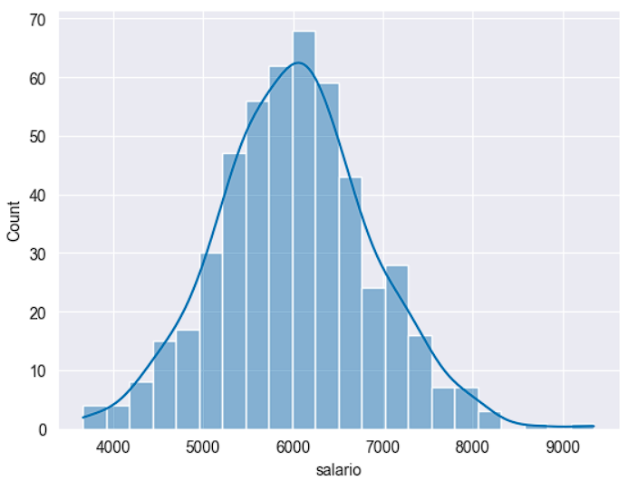
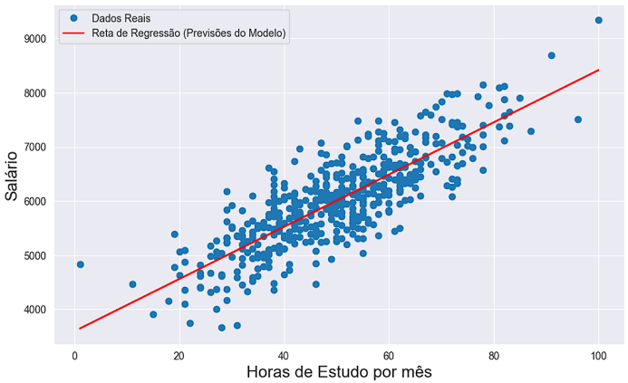

# Exercício - Scikit-Learn - Machine Learning

Exercício do capítulo 15 (Machine Learning com Scikit-Learn) do 
curso Fundamentos de Linguagem Python Para Análise de Dados e Data Science (Com ChatGPT) da Data Science Academy.

## Problema de Negócio

Usando dados históricos é possível prever o salário de alguém com base no tempo dedicado aos estudos em horas por mês?

## Gráficos e Resultados

A distribuição do valor do salário (variável predita):

Gráfico de dispersão do salário por horas estudadas por mês com reta de regressão:

## Referências
Data Science Academy - Fundamentos de Linguagem Python Para Análise de Dados e Data Science: 
https://www.datascienceacademy.com.br/course/fundamentos-de-linguagem-python-para-analise-de-dados-e-data-science , 
Acessado em 28/05/2023.