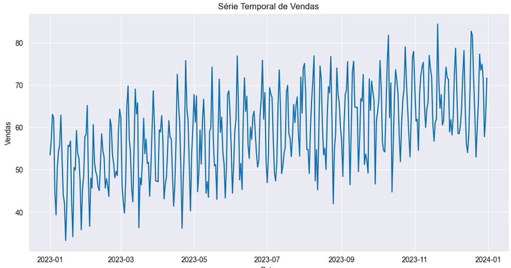
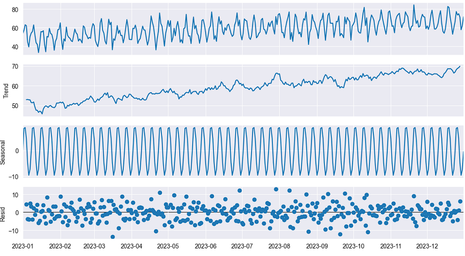
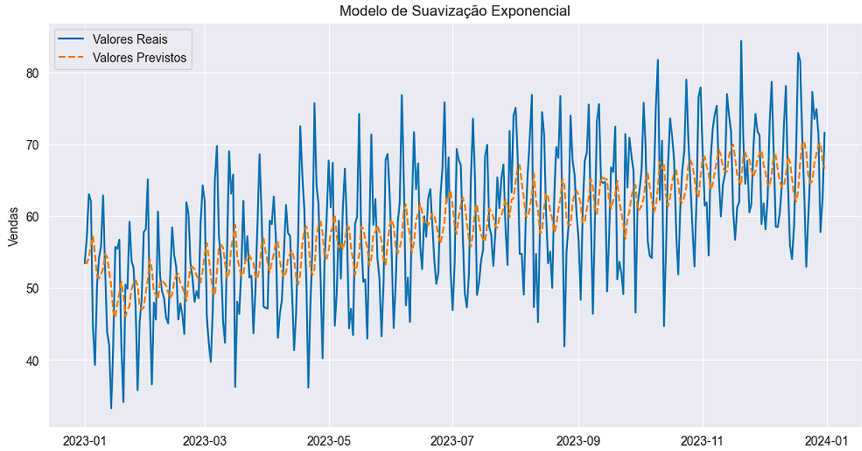

# Exercício - Séries Temporais

Exercício do capítulo 16 (Análise de Séries Temporais em Python) do 
curso Fundamentos de Linguagem Python Para Análise de Dados e Data Science (Com ChatGPT) da Data Science Academy.

Uma série temporal foi analisada e usada para criar um modelo de suavização exponencial.

## Gráficos

Valores de vendas:

Componentes da série:

Modelo de suavização exponencial para a série:

## Referências
Data Science Academy - Fundamentos de Linguagem Python Para Análise de Dados e Data Science: 
https://www.datascienceacademy.com.br/course/fundamentos-de-linguagem-python-para-analise-de-dados-e-data-science , 
Acessado em 15/05/2023.