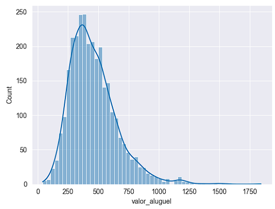
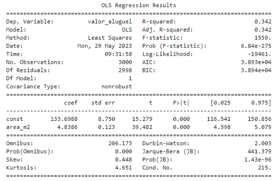
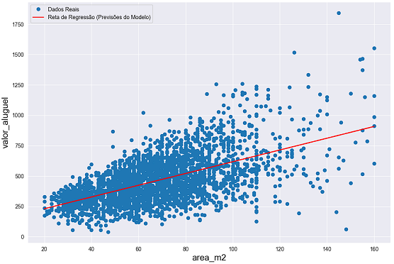

# Exercício - Statsmodels - Análise Estatística

Exercício do capítulo 14 (Análise Estatística com Statsmodels) do 
curso Fundamentos de Linguagem Python Para Análise de Dados e Data Science (Com ChatGPT) da Data Science Academy.

## Problema de Negócio

Existe alguma relação entre a área de imóveis (em metros quadrados) e o valor do aluguel em uma determinada cidade? 

Caso exista relação, como podemos mensurá-la?

## Gráficos e Resultados

A distribuição do valor do aluguel (variável predita):

Estatísticas do modelo de regressão linear treinado:

Gráfico de dispersão do valor de aluguel por área em m2 com reta de regressão:

## Referências
Data Science Academy - Fundamentos de Linguagem Python Para Análise de Dados e Data Science: 
https://www.datascienceacademy.com.br/course/fundamentos-de-linguagem-python-para-analise-de-dados-e-data-science , 
Acessado em 28/05/2023.