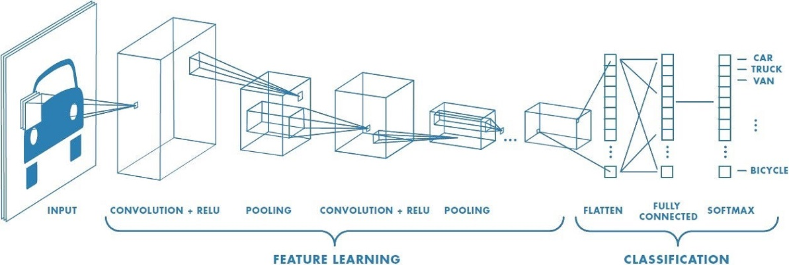

# Exercício - Tensor Flow

Exercício do capítulo 17 (Introdução ao Deep Learning com TensorFlow) do 
curso Fundamentos de Linguagem Python Para Análise de Dados e Data Science (Com ChatGPT) da Data Science Academy.

Dada uma arquitetura de rede neural, foi construído um modelo com o TensorFlow para predição do conteúdo de imagens.

O conjunto de dados foi o cifar10 fornecido pela University of Toronto e TensorFlow.

## Estrutura da Rede Neural

## Referências
Data Science Academy - Fundamentos de Linguagem Python Para Análise de Dados e Data Science: 
https://www.datascienceacademy.com.br/course/fundamentos-de-linguagem-python-para-analise-de-dados-e-data-science , 
Acessado em 06/05/2023.

TensorFlow: https://www.tensorflow.org/datasets/catalog/cifar10?hl=pt-br , Acessado em 07/05/2023.

University of Toronto: https://www.cs.toronto.edu/~kriz/cifar.html, Acessado em 07/05/2023.