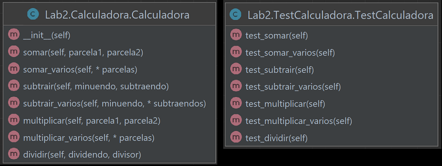

# Lab 2 - Calculadora em Linguagem Python

Implementação de uma calculadora de números inteiros.

## Arquivos

- Calculadora.py: código da classe Calculadora
- TestCalculadora.py: testes da classe Calculadora
- MainCalculadora.py: código que usa a classe Calculadora
- Diagrama-Classe-Calculadora.png: imagem do diagrama da classe Calculadora e TestCalculadora

## Execução

Execute o arquivo MainCalculadora.py no terminal para rodar o programa.

## Diagrama de Classes

